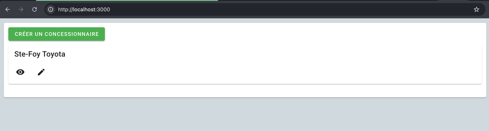
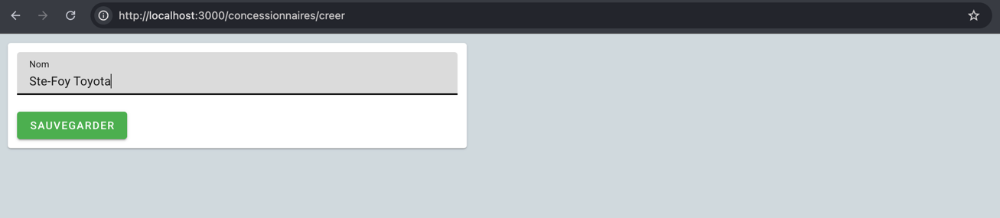
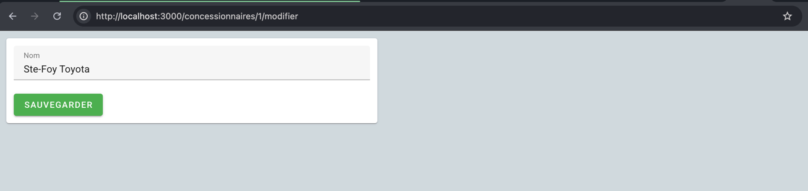
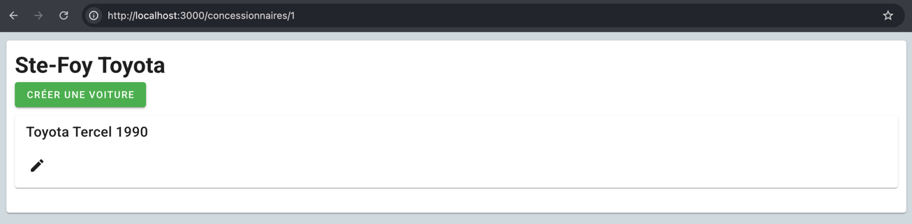
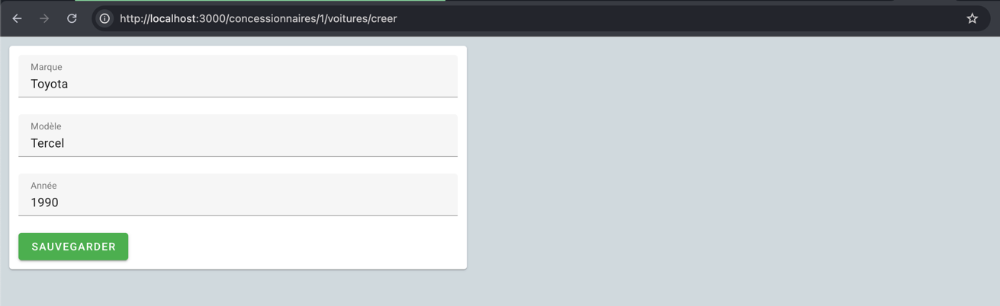
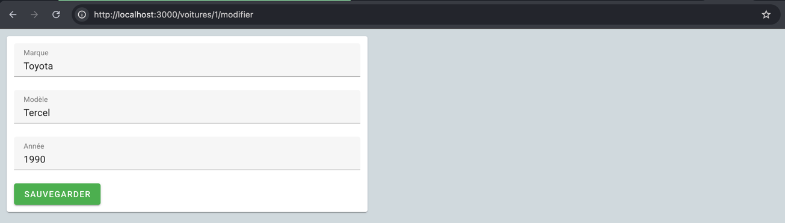

# Test pratique

Ce projet contient une application serveur développée à l'aide de Quarkus,
ainsi qu'une application client développée avec Vue et Vuetify.

Ensemble, elles composent un site web permettant de gérer des concessionnaires. 

Il est possible d'ajouter un concessionnaire et d'y attribuer / modifier le nom.

On peut également ajouter des voitures à ces concessionnaires. Les champs modifiables sont la marque, le modèle, et l'année.

Au fin du test pratique, il faut:

1. Ajouter un champ "prix" aux voitures. Difficile de vendre des voitures sans présenter le prix!
2. Supprimer une voiture. Une fois vendue, on ne veut plus l'afficher.
3. Ajouter un aperçu du nombre de voitures disponibles par concessionnaire sur la page d'accueil.
4. Téléverser votre version du projet sur votre Github / autre hébergeur git et nous retourner l'adresse du projet.

Il n'est pas strictement nécessaire de lancer le projet pour le test.

Cependant, nous recommandons de le faire à l'aide d'Intellij qui offre une intégration pour Quarkus. https://quarkus.io/guides/ide-tooling

Quarkus est configuré pour utiliser une base de données en mémoire H2, il n'est donc pas nécessaire d'installer une base de données pour faire fonctionner le projet.

Pour lancer l'application client, il faut se rendre dans le dossier "frontend" et exécuter les commandes suivantes:

```
npm ci
npm run dev
```

Voiçi des captures écrans pour faciliter la navigation au cas où l'application ne se lance pas:

**Accueil - Liste des concessionnaires**


**Ajout d'un concessionnaire**


**Édition d'un concessionnaire**


**Liste des voitures**


**Ajout d'une voiture**


**Édition d'une voiture**


---

This project uses Quarkus, the Supersonic Subatomic Java Framework.

If you want to learn more about Quarkus, please visit its website: <https://quarkus.io/>.

## Running the application in dev mode

You can run your application in dev mode that enables live coding using:

```shell script
./mvnw quarkus:dev
```

> **_NOTE:_**  Quarkus now ships with a Dev UI, which is available in dev mode only at <http://localhost:8080/q/dev/>.

## Packaging and running the application

The application can be packaged using:

```shell script
./mvnw package
```

It produces the `quarkus-run.jar` file in the `target/quarkus-app/` directory.
Be aware that it’s not an _über-jar_ as the dependencies are copied into the `target/quarkus-app/lib/` directory.

The application is now runnable using `java -jar target/quarkus-app/quarkus-run.jar`.

If you want to build an _über-jar_, execute the following command:

```shell script
./mvnw package -Dquarkus.package.jar.type=uber-jar
```

The application, packaged as an _über-jar_, is now runnable using `java -jar target/*-runner.jar`.

## Creating a native executable

You can create a native executable using:

```shell script
./mvnw package -Dnative
```

Or, if you don't have GraalVM installed, you can run the native executable build in a container using:

```shell script
./mvnw package -Dnative -Dquarkus.native.container-build=true
```

You can then execute your native executable with: `./target/test-pratique-1.0-SNAPSHOT-runner`

If you want to learn more about building native executables, please consult <https://quarkus.io/guides/maven-tooling>.

## Related Guides

- REST Jackson ([guide](https://quarkus.io/guides/rest#json-serialisation)): Jackson serialization support for Quarkus
  REST. This extension is not compatible with the quarkus-resteasy extension, or any of the extensions that depend on it
- JDBC Driver - MariaDB ([guide](https://quarkus.io/guides/datasource)): Connect to the MariaDB database via JDBC
- Hibernate ORM with Panache ([guide](https://quarkus.io/guides/hibernate-orm-panache)): Simplify your persistence code
  for Hibernate ORM via the active record or the repository pattern

## Provided Code

### Hibernate ORM

Create your first JPA entity

[Related guide section...](https://quarkus.io/guides/hibernate-orm)

[Related Hibernate with Panache section...](https://quarkus.io/guides/hibernate-orm-panache)

### REST

Easily start your REST Web Services

[Related guide section...](https://quarkus.io/guides/getting-started-reactive#reactive-jax-rs-resources)
